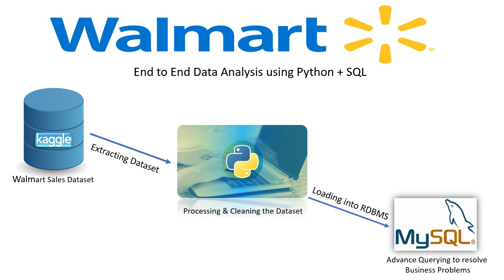

# Walmart_Sales-Analysis_Python-SQL

## Overview
This project is an end-to-end data analysis solution designed to extract critical business insights from Walmart sales data. We utilize Python for data processing and analysis, SQL for advanced querying, and structured problem-solving techniques to solve key business questions.

## Objectives
This project focuses on End-to-End Data Analysis using Python and SQL to extract meaningful insights from Walmart's sales dataset. The key objectives of this project are:

## 1.) Data Extraction:

The dataset, which contains Walmart sales records, is sourced from Kaggle.
It is extracted and prepared for analysis.

## 2.) Data Processing & Cleaning:

Using Python (Pandas), the dataset is preprocessed.
Missing values, inconsistencies, and formatting issues are resolved to ensure data quality.

## 3.) Loading Data into MySQL:

The cleaned dataset is stored in a Relational Database (MySQL) for structured querying.
SQLAlchemy and PyMySQL are used to establish a connection between Python and MySQL, enabling seamless data transfer.

## 4.) Advanced Querying & Business Insights:

SQL queries are used to perform in-depth sales analysis.
Business problems like revenue trends, sales performance, and customer behavior patterns are explored.

## Dataset
The data for this project is sourced from the Kaggle dataset:
- **Dataset Link:** [Walmart_Sales_Dataset](https://www.kaggle.com/datasets/najir0123/walmart-10k-sales-datasets)

## Walmart Business Problems:

## 1.) Analyze Payment Methods and Sales

● Question: What are the different payment methods, and how many transactions and items were sold with each method?
● Purpose: This helps understand customer preferences for payment methods, aiding in payment optimization strategies.

## 2.) Identify the Highest-Rated Category in Each Branch

● Question: Which category received the highest average rating in each branch?
● Purpose: This allows Walmart to recognize and promote popular categories in specific branches, enhancing customer satisfaction and branch-specific marketing.

## 3.) Determine the Busiest Day for Each Branch

● Question: What is the busiest day of the week for each branch based on transaction volume?
● Purpose: This insight helps in optimizing staffing and inventory management to accommodate peak days.

## 4.) Calculate the Total Quantity Sold by Payment Method

● Question: How many items were sold through each payment method?
● Purpose: This helps Walmart track sales volume by payment type, providing insights into customer purchasing habits.

## 5.) Analyze Category Ratings by City

● Question: What are the average, minimum, and maximum ratings for each category in each city?
● Purpose: This data can guide city-level promotions, allowing Walmart to address regional preferences and improve customer experiences.

## 6.) Calculate Total Profit by Category

● Question: What is the total profit for each category, ranked from highest to lowest?
● Purpose: Identifying high-profit categories helps focus efforts on expanding these products or managing pricing strategies effectively.

## 7.) Analyze Sales Shifts Throughout the Day
● Question: How many transactions occur in each shift (Morning, Afternoon, Evening) across branches?
● Purpose: This insight helps in managing staff shifts and stock replenishment schedules, especially during high-sales periods.

## 8.) Identify Branches with Highest Revenue Decline Year-Over-Year
● Question: Which branches experienced the largest decrease in revenue compared to the previous year?
● Purpose: Detecting branches with declining revenue is crucial for understanding possible local issues and creating strategies to boost sales or mitigate losses.
